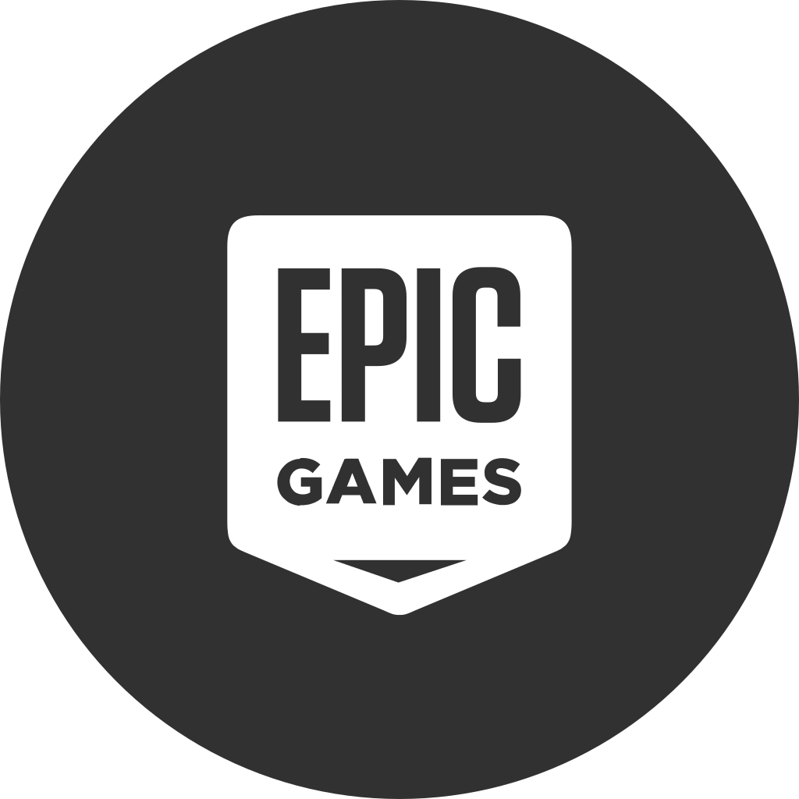

	

		<h1> Speak, Friend, and Enter. </h1>
		<h2> Welcome, I'm Max Mosier! </h2>

 Computer Science graduate currently working as a Front-End Developer at Cognizant. I enjoy being innovative and problem solving issues of varying complexity. Looking to further my education in UI/UX practices and enter Software Development for creative applications, such as, video games, media, and film. 

		

  

   

  

	

	

		
	

# Speak, Friend, and Enter.
### Welcome, I'm Max Mosier!
Computer Science graduate currently working as a Front-End Developer at Cognizant. I enjoy being innovative and problem solving issues of varying complexity. Looking to further my education in UI/UX practices and enter Software Development for creative applications, such as, video games, media, and film.

## :mag_right: Where else can you find me?

<a style={{display: 'flex', flexDirection: 'column'}} href="https://github.com/Mmosier11">
  
  
Dicsord: Taxnan #2497 

</a>
<a style={{display: 'flex', flexDirection: 'column'}} height="32" width="32" href="https://github.com/Mmosier11">
  
  
Epic Games: Taxnan 

</a>
<a  style={{display: 'flex', flexDirection: 'column'}} height="32" width="32" href="https://steamcommunity.com/profiles/76561198067190703">
  
  
Steam: Taxnan 

</a>
<a  style={{display: 'flex', flexDirection: 'column'}} height="32" width="32" href="https://www.linkedin.com/in/max-mosier/">
  
  
Linked-in: Max Mosier 

</a>
<a  style={{display: 'flex', flexDirection: 'column'}} height="32" width="32" href="https://github.com/Mmosier11">
  
  
Twitter: @SenpaiSumpie 

</a>

## :computer: Technologies
 

## :clipboard: Projects
<ul>
	<li><a href="https://github.com/QJMTech/TeamBandit" title="TeamBandit"> TeamBandit Web Application </a></li>
	
 TeamBandit is my current senior capstone project. Along with three others, we are working to create a web application that helps streamline course management. To accomplish this task, my group is working in an agile development process to work with our client to produce their vision. We are currently utilizing PostgreSQL, Node, Express, and React to accomplish our task.

		       
 Take a further look at the website below documenting our process or at the Github repo!

		       <a href="https://ceias.nau.edu/capstone/projects/CS/2022/Outlaws/">https://ceias.nau.edu/capstone/projects/CS/2022/Outlaws/</a>
	

	<li><a href="https://maxmosier.com/game-projects/project-equinox/index.html" title="Equinox"> Project Equinox </a></li>
	
 This is a game project that has been a passion project of mine for a long time. This game is currently being built in Unity v2020.3.18f1 this is going to be a 3D fantasy action RPG that will follow similar story patterns as made in Star Wars Knights of the Old Republic 1 and 2.

	<li><a href="" title="Bequester"> Project Bequester </a></li>
	
 I'm temporarily postponing Project Equinox to create this side project. It is currently being made in Unity v2020.3.26f1. This game will be a small game and plans on combining elements from Fire Emblem, Slay the Spire and Magic the Gathering.

</ul>

## :chart_with_upwards_trend: Github Stats

### Hi there 👋, my name is Max Mosier
#### Spreak, Friend, and Enter

I made this project just for fun, it allows you to create nice and simple GitHub Readme files that you can copy/paste and use in your profile.

Skills: VUE JS / REACT / JS / HTML / CSS

- 🔭 I’m currently working on Front-End Development 
- 🌱 I’m currently learning UI/UX Practices 

        

  

  

  

  

Programmer Vector Art Image provided by Vecteezy.com
